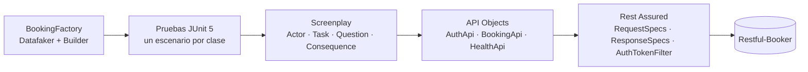

# Restful-Booker · Automatización de API con Rest Assured

Framework de automatización de la API REST de [Restful-Booker](https://restful-booker.herokuapp.com/apidoc/index.html) con **Rest Assured 6**, **Java 21**, **JUnit 5** y el **patrón Screenplay** sobre API Objects, con payloads construidos con **Builder (Lombok)** y datos dinámicos de **Datafaker**.

Las pruebas reportan el comportamiento real de la API. La suite termina en rojo porque detecta **7 defectos verificados**; cada falla está clasificada en el reporte como defecto conocido del producto.

| Resultado de referencia | Pruebas |
|---|---|
| Pasan | 12 |
| Fallan por defectos de la API (DEF-01 a DEF-07) | 11 |
| **Total** | **23** |

El detalle de cada defecto, las decisiones de diseño y los supuestos están en [docs/DECISIONES.md](docs/DECISIONES.md).

## Requisitos previos

- JDK 21 o superior (el código compila con `--release 21`).
- Maven 3.9 o superior.
- Docker, solo para ejecutar contra el ambiente `local`.

## Ejecución

```bash
# Ambiente por defecto (qa): la API pública
mvn clean test

# Ambiente explícito
mvn clean test -Denv=qa

# Ambiente local: contenedor oficial de Restful-Booker
docker run -d -p 3001:3001 mwinteringham/restfulbooker
mvn clean test -Denv=local

# Un escenario o una etiqueta (contract, security, performance, negative, known-defect)
mvn clean test -Dtest=GPathFilteringTest
mvn clean test -Dgroups=security
```

> **`BUILD FAILURE` es el resultado esperado.** Maven marca la ejecución como fallida porque la API tiene defectos. Las pruebas no se relajan para conseguir verde (ver el principio de reporte en [docs/DECISIONES.md](docs/DECISIONES.md#criterios)).

## Reporte

```bash
# Genera el reporte y lo abre en el navegador
mvn allure:serve

# Solo lo genera: target/site/allure-maven-plugin/index.html, un solo archivo que se abre con doble clic
mvn allure:report
```

El reporte de Allure incluye:

- Cada acción y verificación del actor como un paso ("Recepcionista crea una reserva…").
- La petición y la respuesta de cada llamada HTTP, con su comando `curl`.
- Las fallas agrupadas en categorías: defectos conocidos del producto, defectos nuevos, problemas de ambiente y errores de automatización.
- El ambiente de la ejecución (nombre, URI, versión de Java).

Si una validación de Rest Assured falla, la consola también muestra la petición y la respuesta completas (`log().ifValidationFails()` configurado en `LogConfig`).

## Configuración

Cada ambiente es un archivo en `src/main/resources/config/<ambiente>.properties`. Cualquier valor se puede sobrescribir, con esta prioridad: propiedad de sistema, variable de entorno y archivo.

| Clave | Variable de entorno | Uso |
|---|---|---|
| `booker.base-uri` | `BOOKER_BASE_URI` | URL base de la API |
| `booker.username` | `BOOKER_USERNAME` | Usuario de `/auth` |
| `booker.password` | `BOOKER_PASSWORD` | Contraseña de `/auth` |
| `booker.price-threshold` | `BOOKER_PRICE_THRESHOLD` | Umbral de precio del escenario 3 |
| `booker.sla-millis` | `BOOKER_SLA_MILLIS` | SLA de tiempo de respuesta del escenario 4 |
| `booker.nonexistent-booking-id` | `BOOKER_NONEXISTENT_BOOKING_ID` | ID inexistente para los casos negativos |

Los archivos solo contienen las credenciales de demostración que publica la propia API. El token nunca se guarda: se obtiene en cada ejecución.

## Arquitectura



Una prueba se lee como el comportamiento que verifica:

```java
receptionist.attemptsTo(Authenticate.withTheEnvironmentCredentials());
receptionist.attemptsTo(CreateBooking.with(BookingFactory.randomBooking()));
int bookingId = receptionist.asksFor(TheCreatedBooking.id());

receptionist.attemptsTo(UpdateBooking.withId(bookingId).to(changes));
receptionist.should(seeThatResponse("el PUT con el token de la sesión responde 200", okJson()));
```

- **Screenplay** expresa la intención; los **API Objects** encapsulan rutas y métodos HTTP; las **especificaciones** (`RequestSpecBuilder` / `ResponseSpecBuilder`) centralizan URI, formato, timeouts, logs y adjuntos.
- **Paralelismo seguro:** cada prueba tiene su propio actor, su propia sesión y sus propios datos. No se usa configuración estática de Rest Assured.
- **Sesión reutilizable:** el token de `/auth` se guarda en el filtro del actor y se envía como `Cookie: token=<valor>` en PUT, PATCH y DELETE.
- **Limpieza:** las reservas que crea cada prueba se eliminan al terminar, incluso las que la API acepta por error.

## Escenarios y trazabilidad

| Escenario del enunciado | Clase | Qué verifica | Técnica |
|---|---|---|---|
| E1 · Autenticación dinámica y reutilización de sesión | `AuthenticationSessionTest` | Token de `/auth` deserializado a POJO y reutilizado en PUT y DELETE; ciclo crear → actualizar → eliminar → 404 | Transición de estados |
| E2 · Payload dinámico con Builder | `DynamicPayloadTest` | Payload con Builder y Datafaker; respuesta y reserva guardada iguales a lo enviado | Partición de equivalencia |
| E3 · Serialización y GPath | `GPathFilteringTest` | Contrato del listado; filtro `findAll { it.totalprice > umbral }` sin bucles; mapeo a `Booking.class` | Valores límite |
| E4 · Contrato, SLA y headers | `AdvancedValidationsTest` | JSON Schema estricto, tiempo de respuesta, `Content-Type`, header de servidor `Date` (RFC 9110) y headers de seguridad (DEF-06) | Pruebas no funcionales |
| E5 · Negativos y edge cases | `NegativeAndEdgeCasesTest` | 403 sin token o con token inválido, 404 de reserva inexistente y los casos límite que documentan DEF-01 a DEF-05 y DEF-07 | Adivinación de errores, valores límite |

## Estructura del proyecto

```
src/main/java/com/qa/restfulbooker
├── api
│   ├── clients        AuthApi, BookingApi, HealthApi (API Objects)
│   ├── filters        AuthTokenFilter (cookie del token)
│   └── specs          RequestSpecs, ResponseSpecs
├── config             Environment, Credentials (ambiente por -Denv)
├── data               BookingFactory (Datafaker + Builder)
├── models             Booking, BookingDates, BookingResponse, AuthRequest, AuthResponse
├── screenplay
│   ├── core           Actor, Ability, Performable, Question, Consequence
│   ├── abilities      CallTheBookerApi
│   ├── tasks          Authenticate, CreateBooking, UpdateBooking, DeleteBooking…
│   ├── interactions   GetBooking, ListBookingIds, NegotiateBooking, PingTheService
│   ├── questions      TheResponse, TheAuthToken, TheBookingIds, TheBookingDetails…
│   └── consequences   SeeThatResponse
└── support            JacksonMapper

src/test
├── java/com/qa/restfulbooker/scenarios   Un escenario por clase
├── resources/schemas                     JSON Schemas del contrato
├── resources/junit-platform.properties   Ejecución paralela (4 hilos)
└── allure/categories.json                Clasificación de fallas
```

## Integración continua

`.github/workflows/api-tests.yml` ejecuta la suite en cada push a `main`, en cada pull request y a demanda, contra el contenedor (`local`) y contra la API pública (`qa`). El reporte de Allure se publica como artefacto (`allure-report-local` y `allure-report-qa`) aunque haya fallas, y el estado del job refleja el resultado real. Su `index.html` se abre directamente con doble clic: el reporte se genera en un solo archivo porque, con varios, el navegador bloquea la carga de datos desde disco.
